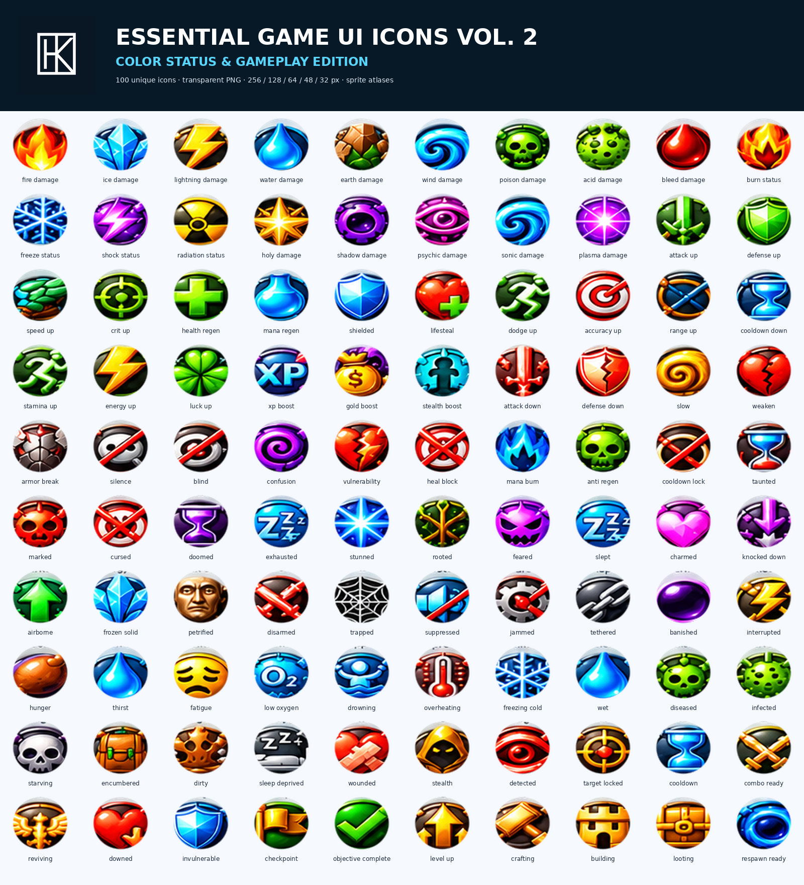

# HK Lab Studio — Software Portfolio

Developer / Publisher: HK Lab Studio  
Website: https://hklabstudio.com

## About

HK Lab Studio develops games, local-first developer tools, interface component systems, and game asset packs. This portfolio provides project-level information only; commercial source repositories are maintained privately.

## Featured Projects

- **Intelligence Studio v2.0.0** — A browser-based workspace for building structured Custom GPT projects, preparing configuration and compliance material, and exporting reusable project deliverables. Commercial source maintained privately.

- **Meteor Defense** — An endless browser arcade game in which players defend a city from incoming threats, avoid friendly craft, collect power-ups, and pursue high scores. Built with Godot 4.7.2. Version 1.0.0.
- **HK ReleaseVerity** — A local-first release-quality tool that consolidates automated release evidence into repeatable quality-gate decisions. Version 1.8.0.
- **HK Web Release Regression Studio** — A local-first workspace for comparing baseline and candidate web releases across desktop, tablet, and phone viewports.
- **HK CSV & Excel Import Wizard** — A browser-based workflow for CSV/XLSX mapping, row validation, transforms, duplicate detection, review, and export. Version 1.0.0.

## Games

### Axirune

A private Godot puzzle project with grid-based levels, directional movement simulation, blockers, goal conditions, and puzzle-simulator tests. The project configuration declares Godot 4.7.

Commercial source repository maintained privately.

### Meteor Defense

An endless browser arcade game where players defend a city from incoming threats, avoid friendly craft, collect power-ups, and pursue high scores as the defense intensity increases. It supports mouse and touch controls, local best-score storage, responsive desktop/tablet/phone layouts, and Web export. Built with Godot 4.7.2. Version 1.0.0.

Commercial source repository maintained privately.

### HK Memory Grid

A visual-memory game in which players memorize highlighted board cells and recreate the pattern after the board clears. It includes selectable difficulty modes, scoring, lives, keyboard controls, and Web export. Built with Godot 4.7.2. Version 1.0.0.

Commercial source repository maintained privately.

## Developer Tools

### Intelligence Studio v2.0.0

A browser-based Custom GPT project builder for organizing instructions, knowledge and configuration requirements, preparing compliance-oriented project material, and exporting structured deliverables including Project JSON, Compliance CSV, and Proposal Markdown.

Commercial source repository maintained privately.
### HK ReleaseVerity

A local-first developer tool that consolidates JUnit, Playwright, Jest, Vitest, LCOV, Cobertura, and SARIF evidence into release-gate decisions and exportable evidence packs. Version 1.8.0.

Commercial source repository maintained privately.

### HK Web Release Regression Studio

A local-first release QA workspace for controlled browser checks, baseline-versus-candidate comparison, release classification, review decisions, and evidence-package export.

Commercial source repository maintained privately.

### HK MCP Tool Contract QA Studio

A local-first utility for reviewing imported tool-contract snapshots, JSON Schema quality, baseline/candidate differences, and release-readiness reports. Version 1.4.

Commercial source repository maintained privately.

### HK CSV & Excel Import Wizard

A provider-neutral React product for importing CSV/XLSX files, mapping source columns to configured schemas, validating and transforming rows, detecting duplicates, reviewing row-level issues, and exporting validated data. Version 1.0.0.

Commercial source repository maintained privately.

### HK Game Localization Handoff Builder

A local browser application for preparing translator-ready game localization handoff packages from CSV, XLSX, or JSON strings. It supports context metadata, validation, screenshot association, and package export. Version 1.0.0.

Commercial source repository maintained privately.

### HK Input Remap & Prompt System for Godot

A dependency-free Godot input utility for runtime rebinding, conflict handling, persistent custom bindings, active-device detection, and user-facing prompt text. Version 1.0.0.

Commercial source repository maintained privately.

## UI & Component Systems

### HK Agent UI Vol. 1 — React Edition

A collection of 25 configurable React UI components for tool execution, connection states, approvals, usage, citations, permissions, workflows, and operational feedback. Built with React, TypeScript, Tailwind CSS, and Vite. Version 1.0.0.

Commercial source repository maintained privately.

### HK AI Chat & Tool Calling UI Kit

A standalone React frontend component kit for chat, tool-calling interfaces, source citations, approvals, activity, and model/context feedback. Built with React, TypeScript, Tailwind CSS, and Vite. Version 1.0.0.

Commercial source repository maintained privately.

### HK Agent UI Vol. 2 — Developer States Edition

A React component pack for common application and developer states, including loading, errors, permissions, progress, deployment, and system health. Built with React, TypeScript, Tailwind CSS, and Vite.

Commercial source repository maintained privately.

## Asset Packs

### Essential Game UI Icons Vol. 2

A commercial game UI asset pack for gameplay feedback, status effects, elemental damage, buffs, debuffs, control states, and survival conditions. It contains 100 PNG icons, sprite atlases, coordinate maps, and JSON/CSV manifests. Version 1.0.0.

Commercial source repository maintained privately.

### HK 100 Game Icons

A commercial game UI asset pack containing 100 icons for interface and gameplay use, with light and dark SVG variants and transparent PNG exports. Version 1.0.

Commercial source repository maintained privately.

## Engineering & Validation

The following validation capabilities are documented in the corresponding private project materials. They are not claims that validation was run for this portfolio repository.

- Meteor Defense documents a package validator and Godot headless logic-test command.
- Axirune includes puzzle-simulator coverage for successful routes, empty landings, blockers, boundaries, loops, and exact-goal behavior.
- HK Memory Grid documents package validation, Godot headless parse validation, and deterministic logic tests.
- HK Input Remap & Prompt System documents Godot-version testing and a headless test runner.
- HK CSV & Excel Import Wizard documents type checking, unit tests, production builds, package auditing, and browser tests.
- HK MCP Tool Contract QA Studio documents type checking, unit tests, production builds, and browser tests.
- HK Web Release Regression Studio documents type checking, unit tests, production builds, and browser checks.
- HK Agent UI Vol. 1 documents dependency installation, TypeScript checking, production builds, component rendering, responsive review, and console/runtime checks.
- HK AI Chat & Tool Calling UI Kit documents dependency installation, TypeScript checking, production builds, and responsive preview validation.

## Technology Stack

- Godot and GDScript
- Godot Web export
- React, TypeScript, Tailwind CSS, and Vite
- Node.js and Python
- Vitest and Playwright
- JSON Schema
- Papa Parse and ExcelJS

## Repository Availability

The projects described here are commercial products and tools. Commercial source repositories are maintained privately.

## About HK Lab Studio

Developer / Publisher: HK Lab Studio

## Contact

Website: https://hklabstudio.com

